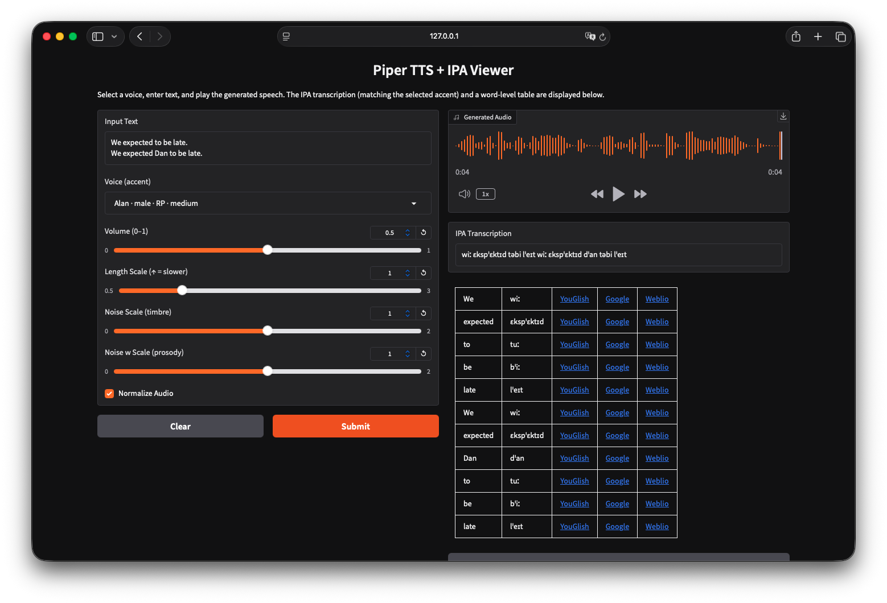

# Piper TTS UI for English Learners

## What is this?

This is a simple project that provides:

✅ Text-to-Speech (TTS) for English learners  
✅ IPA (International Phonetic Alphabet) view to improve pronunciation

It runs locally on your computer and only requires a CPU.  
No need for a high-spec GPU or paid APIs like OpenAI TTS.
- Text-to-Speech uses [Piper TTS](https://github.com/rhasspy/piper)
- IPA transcription uses [Phonemizer](https://github.com/bootphon/phonemizer)

This project is free and open source, so anyone can use it!

[show demo video](./demo.mp4)




⸻

## Installation

1. Create and activate a virtual environment

```
python -m venv piper-venv
source piper-venv/bin/activate   # On macOS/Linux
# On Windows: piper-venv\Scripts\activate
```


2. Install dependencies
```
pip install -r requirements.txt
```

⸻

## Download Voices

Create a models folder and download English voices:

```sh
mkdir models
cd models
```

## British English voices

```sh
python -m piper.download_voices en_GB-alan-medium
python -m piper.download_voices en_GB-cori-medium
python -m piper.download_voices en_GB-cori-high
python -m piper.download_voices en_GB-semaine-medium
python -m piper.download_voices en_GB-southern_english
python -m piper.download_voices en_GB-northern_english_male
python -m piper.download_voices en_GB-alba-medium
python -m piper.download_voices en_GB-jenny_dioco-medium
python -m piper.download_voices en_GB-aru-medium
python -m piper.download_voices en_GB-vctk-medium

# American English voices
python -m piper.download_voices en_US-lessac-medium
python -m piper.download_voices en_US-norman-medium
python -m piper.download_voices en_US-sam-medium
python -m piper.download_voices en_US-ryan-high
```


You can also find more models here:
👉 [Hugging Face - Piper Voices](https://huggingface.co/rhasspy/piper-voices/tree/main/en)

⸻

## Run the App

After downloading voices, start the UI server:
```sh
python tts_ui.py
```

Then open the app in your browser (usually at http://127.0.0.1:7860).

⸻

## Notes & Warnings
- This project has been tested only on macOS with Apple Silicon (M4).
- It may not work on Windows PCs or Intel-based Macs without modifications.
- If you encounter issues on other platforms, feel free to open an issue on GitHub.

⸻

## License

This project is free to use under the MIT License.
